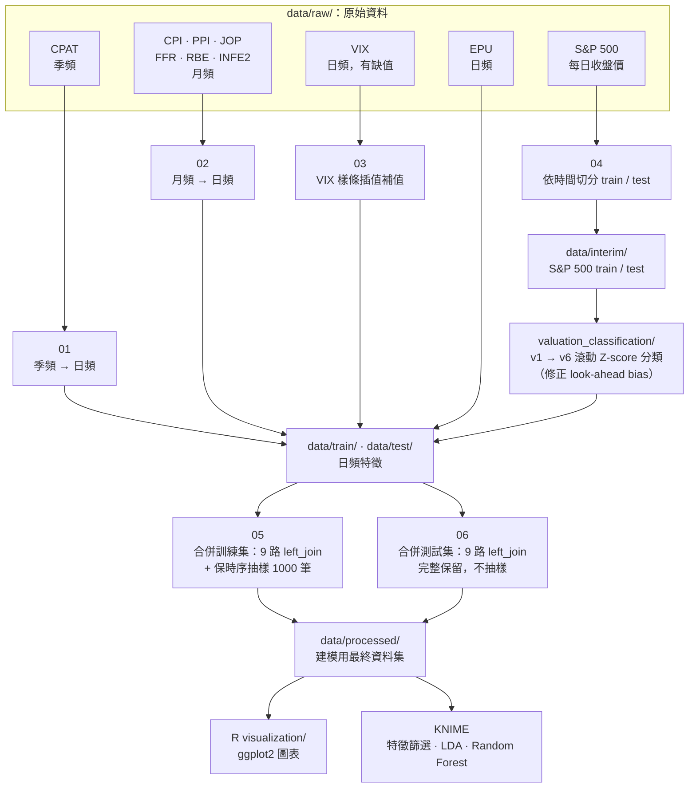
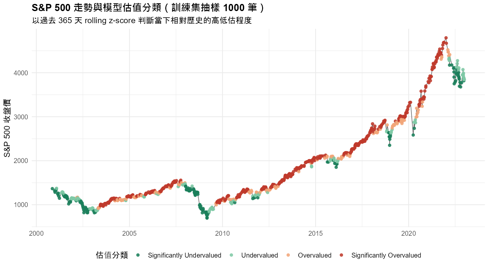
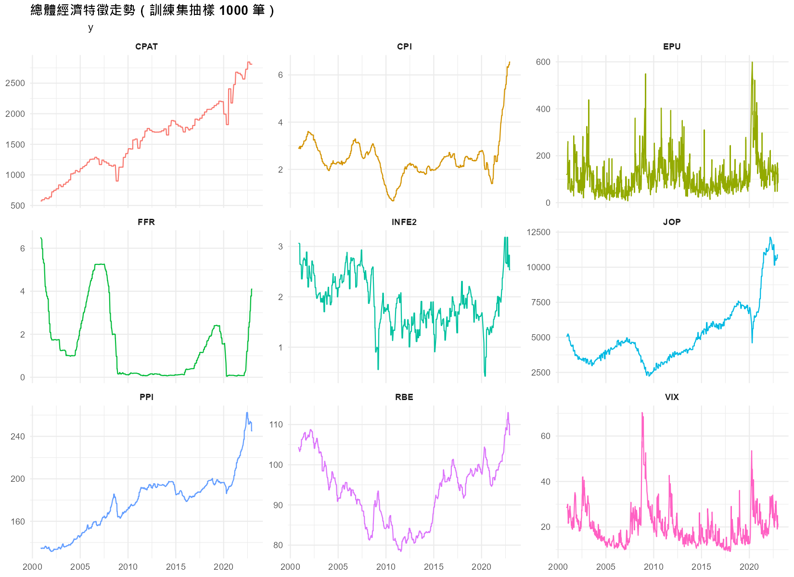
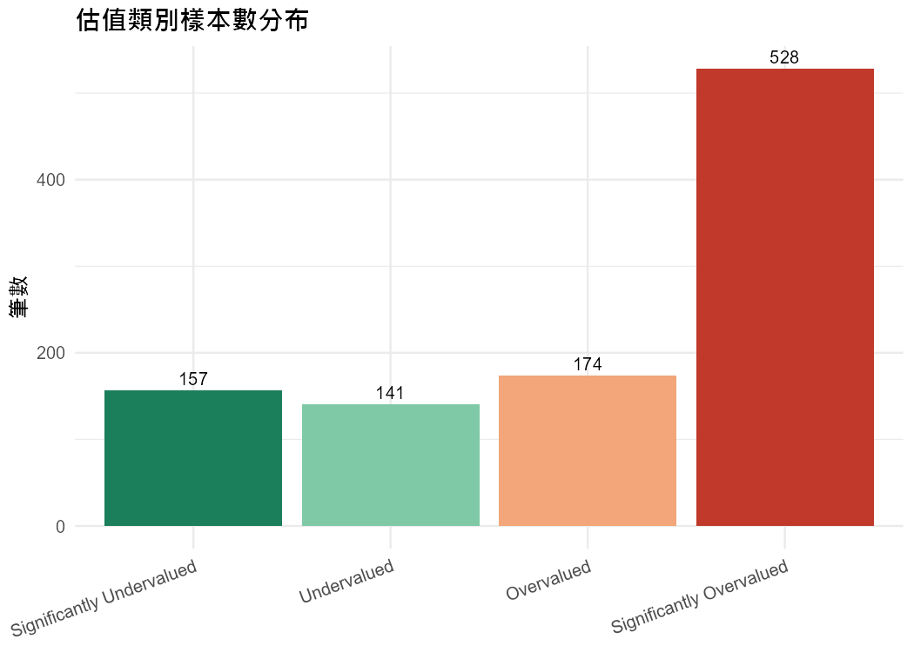
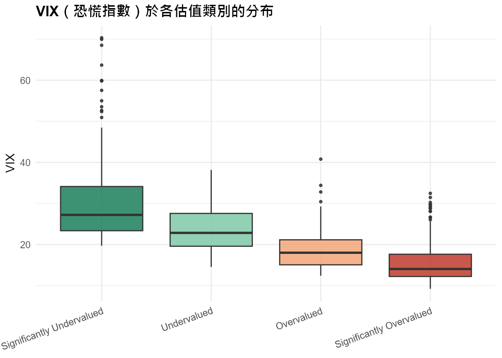
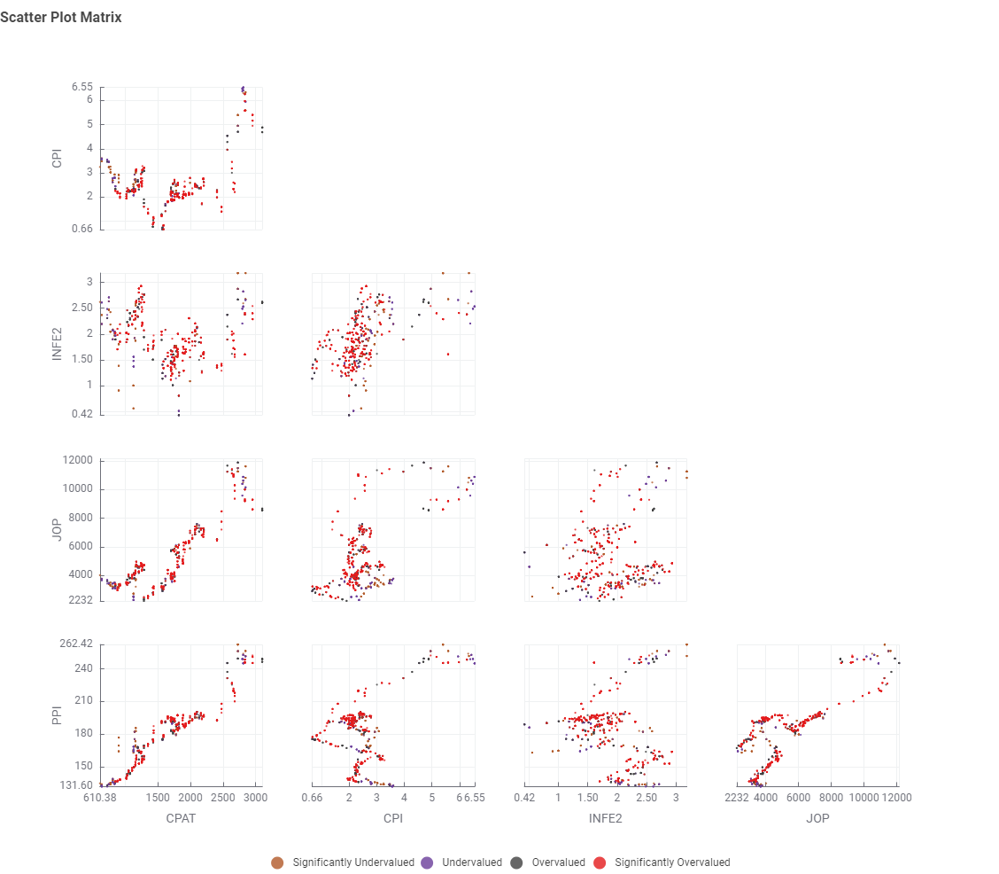
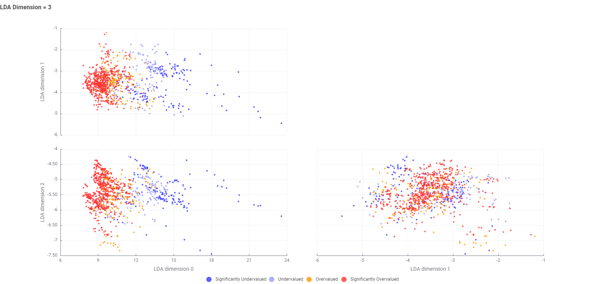
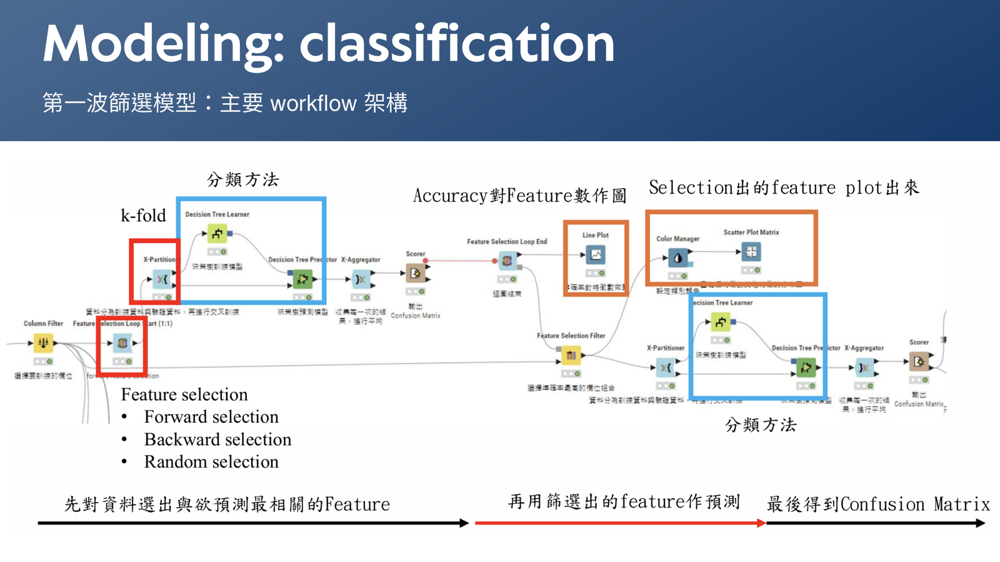

# S&P 500 估值偵測器（SP500 Undervalue Detector）

融合總體經濟特徵選擇與監督式學習，判斷 S&P 500 在特定時間點是否處於「顯著低估 / 低估 / 高估 / 顯著高估」的四級財經估值狀態。

政治與總體經濟事件常讓美股表現大幅偏離實質經濟基本面，本專題嘗試用科學化的資料處理流程，把多個總體經濟指標整理成單一時間序列資料集，作為輔助投資人理性判斷的參考依據。

本專題為 2025 年「資料科學與數據分析」課程期末專題，2 人小組（CRISP-DM 流程：Business Understanding → Data Understanding → Data Preparation → Modeling → Evaluation），指導教授為莊鈞翔老師（授課當時任教於清華大學教育學院，隔學期轉任工業工程學系）。本 repo 由團隊中負責**資料整理、清洗與特徵前處理（R）**的成員（本人）重新整理發布，並額外補充數張 R 視覺化圖表，作為求職作品集使用。

> 這個 README 特別聚焦在**資料清理與預處理**、**資料視覺化**、**R 語言**三項能力的實際展現，供職缺面試參考。

---

## 這個專案展示了什麼能力

| 能力 | 在這個專案中的具體展現 |
|---|---|
| **資料清理與預處理** | 9 種頻率不一致（日／月／季）的總經指標，統一展開為日頻資料；VIX 缺值以三次樣條插值（而非簡單填補）補齊；多來源資料以 `Date` 為鍵做 9 路 left join；時間序列採「時間切分」而非隨機切分，避免用未來資料預測過去 |
| **資料視覺化** | 以 R（ggplot2）繪製估值分類時間軸、總經指標小圖 (small multiples)、類別分布與特徵區隔力盒鬚圖；另有團隊以 KNIME 產出的散佈圖矩陣、LDA 投影與 workflow 架構圖 |
| **R 語言** | 全部資料前處理管線（`R/01`–`R/06`）皆以 R（`dplyr`、`readr`、`lubridate`、`zoo`、`tidyr`、`ggplot2`）撰寫；程式碼經重構去除原始版本中重複複製貼上的區塊，改寫成可重用函式 |
| **方法論嚴謹度／除錯能力** | `R/valuation_classification/` 保留 v1 → v6 的完整迭代紀錄，其中 v5 修正了 v2–v4 版本中「用當日前後 ±365 天資料計算 z-score」所造成的 **look-ahead bias（資料洩漏）**，改為只使用歷史資料的滾動窗口 |

---

## 專案背景與目標

- **問題意識**：美股表現常隨市場情緒大幅波動，多次背離美國實質經濟的基本面；股市的高度波動同時也是風險與機會。
- **目標**：整合多項總體經濟特徵，以科學方法判斷 S&P 500 在特定時間點的相對估值，作為輔助理性投資決策的參考模型。
- **預測目標**：將連續數值的 S&P 500 收盤價，透過滾動 Z-score 轉換為 4 個類別型標籤：
  `Significantly Undervalued`（顯著低估）／`Undervalued`（低估）／`Overvalued`（高估）／`Significantly Overvalued`（顯著高估）

## 資料來源

S&P 500 歷史股價取自 [Kaggle](https://www.kaggle.com/datasets/paveljurke/s-and-p-500-gspc-historical-data)，其餘 9 項總體經濟特徵皆取自 [FRED（美國聯邦準備銀行經濟資料庫）](https://fred.stlouisfed.org/)：

| 指標 | 說明 | FRED 代碼 |
|---|---|---|
| EPU | 經濟政策不確定性指數 | [USEPUINDXD](https://fred.stlouisfed.org/series/USEPUINDXD) |
| VIX | CBOE 波動率指數（恐慌指數） | [VIXCLS](https://fred.stlouisfed.org/series/VIXCLS) |
| PPI | 生產者物價指數（製造業總指數） | [PCUOMFGOMFG](https://fred.stlouisfed.org/series/PCUOMFGOMFG) |
| CPI | 核心消費者物價指數（剔除食品與能源） | [CORESTICKM159SFRBATL](https://fred.stlouisfed.org/series/CORESTICKM159SFRBATL) |
| JOP | 非農就業職缺總數 | [JTSJOL](https://fred.stlouisfed.org/series/JTSJOL) |
| RBE | 實質廣義有效匯率 | [RBUSBIS](https://fred.stlouisfed.org/series/RBUSBIS) |
| FFR | 聯邦基金有效利率 | [DFF](https://fred.stlouisfed.org/series/DFF) |
| CPAT | 稅後企業利潤（含存貨與資本消耗調整） | [CPATAX](https://fred.stlouisfed.org/series/CPATAX) |
| INFE2 | 兩年期通膨預期 | [EXPINF2YR](https://fred.stlouisfed.org/series/EXPINF2YR) |

---

## 資料處理管線（Data Pipeline）

```
raw data (data/raw/)
   │  日／月／季頻率不一，欄位命名不一致
   ▼
01  季頻 → 日頻          (CPAT)
02  月頻 → 日頻          (CPI, PPI, JOP, FFR, RBE, INFE2)
03  VIX 缺值樣條插值      (VIX)
04  S&P 500 依時間切分    (train: 2000–2022 / test: 2023–2025.05) → data/interim/
   ▼
valuation_classification/  滾動 Z-score 高低估分類 (v1 → v6 迭代，修正 look-ahead bias)
                            data/interim/ → data/train|test/zEVA_sp500_*.csv
   ▼
05  合併訓練集：9 路 left join + 移除缺值 + 保時序等機率抽樣至 1000 筆
06  合併測試集：9 路 left join + 移除缺值（完整保留，不抽樣）
   ▼
data/processed/  ── 建模用最終資料集 ──▶  KNIME：特徵篩選、LDA、Random Forest 分類
   ▼
visualization/  以 R (ggplot2) 產出估值時間軸、指標走勢、類別分布圖
```

### 架構圖



## 資料清理與前處理重點

1. **頻率對齊**：CPAT（季）、CPI／PPI／JOP／FFR／RBE／INFE2（月）皆以「當期公布值前向填補至該期每一天」的方式展開為日頻，才能與日頻的 S&P 500、VIX 對齊。
2. **缺值處理**：VIX 原始資料在非交易日／假日會有缺漏，若簡單前向填補會失真，因此改用三次樣條插值 (`zoo::na.spline`)，讓數值變化更平滑、更貼近真實走勢（見 [`03_interpolate_vix_spline.R`](R/03_interpolate_vix_spline.R)）。
3. **多來源合併**：9 個獨立指標檔案以 `Date` 為鍵依序 `left_join`，並在合併後 `na.omit()` 移除任一特徵缺漏的日期，確保每一列資料在所有特徵上都完整。
4. **時間切分而非隨機切分**：訓練 / 測試集依日期範圍切分（2000–2022 vs. 2023–2025），避免時間序列中常見的「用未來資訊預測過去」問題。
5. **修正資料洩漏（look-ahead bias）**：高低估分類邏輯在 [`R/valuation_classification/`](R/valuation_classification) 中歷經 6 次迭代——v2–v4 版本以「當日前後各 365 天」計算 rolling z-score，等於用了未來股價分佈去判斷當下，這在真實部署情境是不成立的；v5/v6 修正為只使用「當日之前」的滾動窗口，並加入 200 日均線乖離率作為輔助判斷，最終收斂為貼近財經實務用語的 4 級分類。
6. **隱性型別／格式不一致導致 join 大量失敗**：重建這條 pipeline 時實際踩到兩層問題——(1) 9 個特徵檔案中，多數欄位被 `readr` 依抽樣結果自動猜測為 `Date` 型別（轉字串後變成 `2000-11-01`），少數猜成 `character`（維持 `2000/11/01`），型別不一致讓 `left_join` 鍵值完全對不上；(2) 修正型別後，仍有一個未經處理的原始日頻來源（EPU）日期沒有補零（`2024/1/1` 而非 `2024/01/01`），與其他已重新輸出的檔案格式不一致，同樣的問題再度發生。兩者都會讓合併後 `na.omit()` 悄悄刪掉大量甚至全部資料，且不會跳出錯誤訊息，很容易被忽略。修正方式是在 [`05_merge_train_dataset.R`](R/05_merge_train_dataset.R)／[`06_merge_test_dataset.R`](R/06_merge_test_dataset.R) 中統一先以 `col_types = cols(Date = col_character())` 讀入，再用 `as.Date()` 正規化、重新輸出成固定格式後才做 `left_join`。修正後訓練集回到 1000 筆、測試集回到 332 筆（2023/12/1–2025/3/31），與團隊原始繳交的期末報告數字一致。
7. **最後一期資料的前向填補策略**：CPAT（稅後企業利潤）是季資料，原始展開邏輯只把每一期填到「該季結束」，若最新一期（如 2024 Q4）之後沒有更新的資料，時間軸繼續往後推進時就會出現缺值，導致測試集在合併後被截斷在最新一期結束的那天。修正為模擬真實世界「主管機關尚未公布下一期數字前，沿用最近一期已知值」的假設，把最後一期持續前向填補，真正的有效範圍則交由其他特徵（如 JOP、RBE）的實際涵蓋範圍自然決定（見 [`01_convert_quarterly_to_daily.R`](R/01_convert_quarterly_to_daily.R)）。

## 資料視覺化

**R（ggplot2，本次求職作品集補充）**

| | |
|---|---|
|  |  |
|  |  |

對應腳本：[`R/visualization/`](R/visualization)（`07` 估值時間軸／`08` 指標走勢小圖／`09` 類別分布與特徵區隔力）

**KNIME（團隊產出，特徵篩選與模型結果，取自實際繳交的期末報告）**

| | |
|---|---|
|  |  |



## 建模與結果摘要

特徵篩選、監督式分類建模（含 LDA 降維、Random Forest 等方法）與 k-fold 交叉驗證評估，於 [`knime/`](knime) 中的兩支 KNIME workflow 完成：

- `第一波篩選模型.knwf`：初步特徵篩選
- `第二波評價模型.knwf`：分類模型建置與績效評估（Accuracy、F1、混淆矩陣）

---

## 專案結構

```
sp500-undervalue-detector/
├── R/
│   ├── 01_convert_quarterly_to_daily.R
│   ├── 02_convert_monthly_to_daily.R
│   ├── 03_interpolate_vix_spline.R
│   ├── 04_split_sp500_train_test.R
│   ├── 05_merge_train_dataset.R
│   ├── 06_merge_test_dataset.R
│   ├── valuation_classification/     # 高低估分類邏輯 v1 → v6 迭代
│   └── visualization/                # ggplot2 視覺化（作品集補充）
├── data/
│   ├── raw/                          # 原始資料（未清理）
│   ├── interim/                      # 依時間切分、尚未加上估值標籤的 S&P 500
│   ├── train/ , test/                # 轉換為日頻、清理後的各項特徵
│   └── processed/                    # 最終建模用合併資料集
├── knime/                            # 特徵篩選與分類模型 workflow
├── docs/images/                      # 圖表輸出
├── LICENSE
└── README.md
```

## 如何執行

```r
install.packages(c("readr", "dplyr", "tidyr", "lubridate", "zoo", "ggplot2"))

# 依序執行資料前處理管線（工作目錄需為本 repo 根目錄）
source("R/01_convert_quarterly_to_daily.R")
source("R/02_convert_monthly_to_daily.R")
source("R/03_interpolate_vix_spline.R")
source("R/04_split_sp500_train_test.R")
source("R/valuation_classification/v6_final_reusable_function.R")
source("R/05_merge_train_dataset.R")
source("R/06_merge_test_dataset.R")

# 產出視覺化圖表
source("R/visualization/07_visualize_sp500_valuation_timeline.R")
source("R/visualization/08_visualize_macro_indicator_trends.R")
source("R/visualization/09_visualize_valuation_distribution.R")
```

`data/processed/` 中已附上前處理完成的最終資料集，若只想重現視覺化或接續 KNIME 建模，可以跳過前處理步驟直接使用。

## 團隊與分工

2 人小組專題，CRISP-DM 各階段分工如下：

- **資料整理、清洗與前處理（R）**：本人 — 即本 repo 主要內容
- **建模、特徵篩選、統計檢定與視覺化（KNIME）**：團隊夥伴

課程：2025 年「資料科學與數據分析」（Data Science and Analytics），指導教授莊鈞翔老師。

## License

[MIT](LICENSE)
